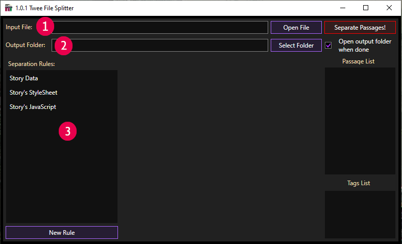
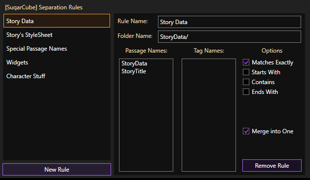
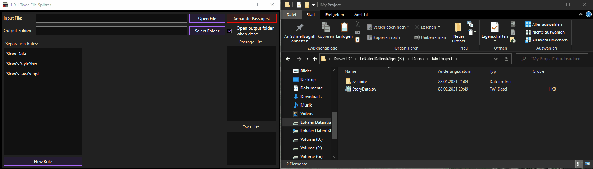

## Welcome to Gwen[Tastic]'s Twee File Splitting Tool!
A self-contained Desktop application for turning the large files, which come from decompiling a Twine html file, into smaller ones with options to define your folder and file structure.

<blockquote class="warning">This is an unsigned Application, which accesses the File system so Windows Defender might Interfere with this application, if writing the files takes significant longer then it had reading them (after inputting a source file) the it's probably due to Windows Defender. Not suggesting turning it off, but doing so can make a difference of the process taking an Hour or less then a minute depending on file size.</blockquote>

### Usage:
Once it's downloaded and running there are 3 Main things:
> 1. The Input file you can choose the file to split as Input File.
> 2. An Output folder in which all Files and Folders should be created in.
> 3. Separation Rules, the list on the left side shows all current Separation rules, these rules determine how Passages get sorted and/or Merged.

You can type directly in those Textboxes to set an Input file or Output Folder, or use the Open File/Folder buttons.
After you selected an Input file, it will read the Passage names and Tags and add them in the lists on the right side.

<blockquote class="info">When you have a Separation-Rule open you can quickly add/remove a Passage/Tag name to the rule using the Listboxes on the right (left/right mouse click).</blockquote>

 
You can alter Separation Tools by clicking on the Listbox Item on the left, add new ones by clicking the Button "New Rule" under the Listbox for the Separation Rules.

#### Separation Rules:
Once you have selected a rule, a Panel in the middle will open up, in there you'll find the settings.

> - `Rule Name:` This field can be ignored since it's only for the application and only affects the name in the list on the left.
> - `Folder Name:` Setting this field will create a folder or even Folders within Folders. 
> - `Passage Names:` A list of passage names that will be associated with this rule.
> - `Tag Names:` A list of Tag names that will be associated with this rule.
> - `Options:` In here your search criteria can be set in which files should be sorted into a folder and/or merged into a single file.
> > `Matches Exactly:` If a Passage matches exactly one of the Passage/Tag Names from the list then it will be sorted in the given folder. 
> > `Starts With:` Meant for prefixes as an example `Story` would Match with `StoryData` and `StoryTitle`. 
> > `Contains:` Only needs to appear within the string, eg.: `Widget` contains `idg`. 
> > `Ends With:` Meant as a Suffix, same as `Starts With` just that it searches how the passage/tag ends. 
> > `Merge into One:` When selected it will merge every match into a single file, for example `StoryData` and `StoryTitle` would be contained by 1 `StoryData.tw` file. 

Once you are done setting up the rules you can hit the red `Separate Passages!` button.

<blockquote class="info">Setting rules is optional you can also just hit the red "Separate Passages!" button immediately</blockquote>

## Showcase:
Here's an example workflow

