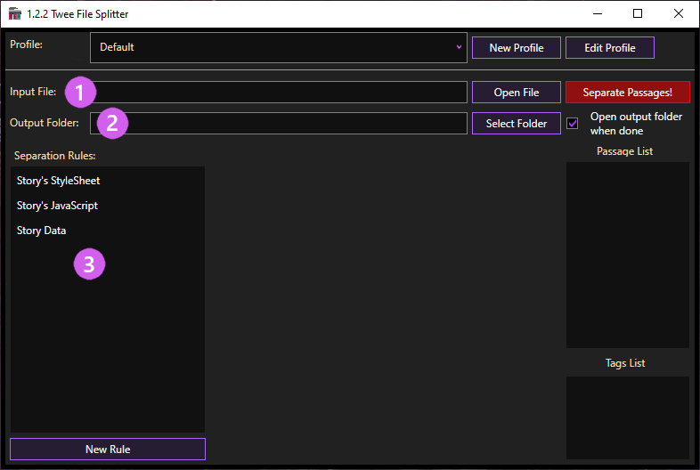
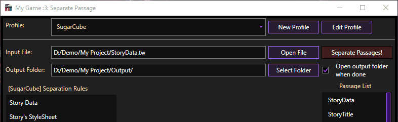
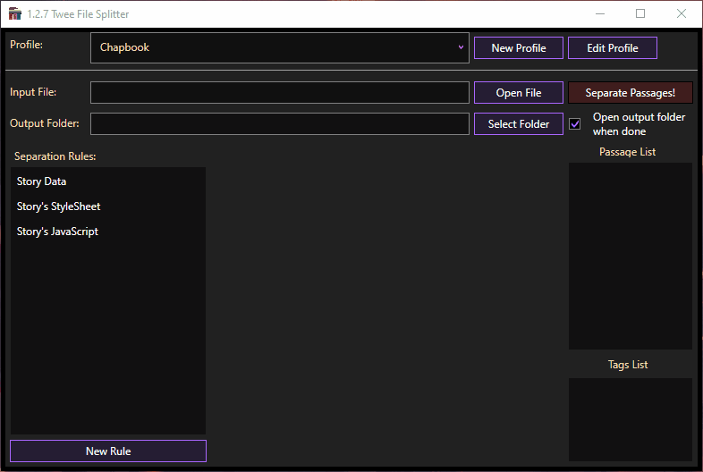
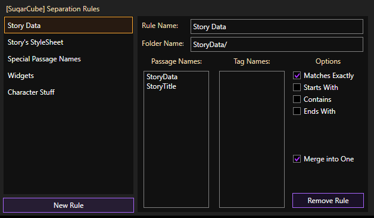
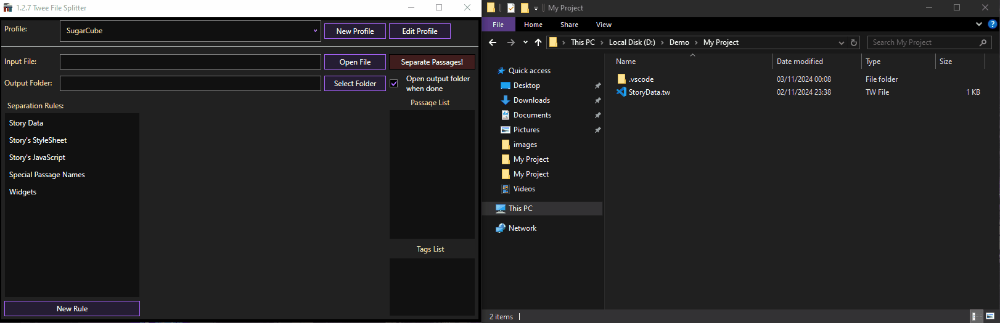

## Welcome to Gwen[Tastic]'s Twee File Splitting Tool!

A self-contained Desktop application for turning the large files, which come from decompiling a Twine html file, into smaller ones with options to define your folder and file structure.
<blockquote class="warning">This is an unsigned Application, which accesses the file system so Windows Defender might interfere with this application, if writing the files takes significant longer then it had reading the passages and tags (after inputting a source file) then that's probably due to Windows Defender. Not suggesting turning it off, but doing so can make a difference of the process taking an Hour or less then a Minute depending on file size.</blockquote>

### Usage:
Once it's downloaded and running there are 3 Main things:
> 1. The Input file you can choose the file to split as Input File.
> 2. An Output folder in which all Files and Folders should be created in.
> 3. Separation Rules, the list on the left side shows all current Separation rules, these rules determine how Passages get sorted and/or Merged.

You can type directly in those Textboxes to set an Input file or Output Folder, or use the Open File/Folder buttons.
After you selected an Input file, it will read the Passage names and Tags and add them in the lists on the right side.

<blockquote class="info">When you have a Separation-Rule open you can quickly add/remove a Passage/Tag name to the rule using the Listboxes on the right (left/right mouse click).</blockquote>

 
You can alter Separation Tools by clicking on the Listbox Item on the left, add new ones by clicking the Button "New Rule" under the Listbox for the Separation Rules.

### Profiles:
A Profile consist out of:
> - `Name:` Which will be displayed in the Combobox, there can be multiple Profiles with the same name.
> - `Is Default:` A flag to automatically select a Profile upon Startup, there can only be one default Profiule (Indicated by a yellow Star in the Combobox).
> - `Rules:` A list of Seperation Rules that belong to the Profile, Copying a Rule from one profile to another will duplicate the rule for the selected Profile as to not accidentally delete or otherwise affect the original Rule.

When creating or editing an existing Profile you can copy existing Seperation Rules from other Existing Profiles. 
To delete a profile, select the profile you want to delete from the Combobox, then hit the `Edit Profile` button on the right of the Profile's Combobox. This will open a new window for the selected Profile and at the bottom of which is the `Delete` button to delete the Profile that's being Edited.

<blockquote class="info">
  Profiles and Seperation Rules are both stored in a SQLite Database which can be found under:  
  > <code class="language-plaintext highlighter-rouge">.../AppData/Local/TweeFileSplitter/TweeFileSplitter.db</code>  
  You can type <code class="language-plaintext highlighter-rouge">%localappdata%</code > into the File explorer to quickly navigate to the <code class="language-plaintext highlighter-rouge">.../AppData/Local</code> Folder.
  <blockquote class="warning">
    Do note that this Application will automatically create a SQLite database in the User's AppData/Local folder, BUT it does not automatically delete itself should you want to uninstall or remove the Application from your Computer.
  </blockquote>
</blockquote>
<blockquote class="info">
  If no Profile exists, then 4 Default Profiles are created (one for each Default Twine StoryFormat) at Startup of the Application.
  While there are no backups kept you can restore the initial state by either deleting all profiles and restarting the application, or by deleting the database file inside `AppData/Local/TweeFileSplitter` folder, and restarting the application again which will then recreate the default StoryFormat profiles again.
</blockquote>
<blockquote class="warning">
  The Application does not create backups for Profiles/Rules. 
  If you accidentally delete a Profile or Rules there's no way of recovering it other then recreating it manually.
</blockquote>

#### The Default Profile:
The default Profile is the Profile that will be automatically selected to be used when the Application is started up, it will also appear at the top of the dropdown menu of the Profile's Combobox.  
You can quickly switch which profile is used as the default profile by clicking on the Star icon from the dropdown list. Tho there can only be 1 Default Profile.  
Demo of quickly switching Profiles: &emsp;&emsp;&emsp;&emsp;&emsp;&emsp;&emsp;&emsp;

#### Demo Profiles
You can Create, Edit, and Delete Profiles. When creating a new or editing an existing Profile you can create a copy of already exsisting Rules from any other profile that exists.
If there are no other Profiles you still get a Default option of `StoryData`, `Story's JavaScript`, and `Story's Stylesheet`.
<blockquote class="info">
  Should you have made changes that you regret, like accidentally deleting a Rule or even all Rules while editing a Profile. You can hit the X button in the top right corner of the Application to close the Edit Profile Window.  
  This will not close the application but will disregard all changes that were made and display the Main Window again. 
  Changes will only be applied when the Save button is clicked or when the Delete button clicked and the deletion confirmed.
</blockquote>
 

### Separation Rules:
Once you have selected a rule, a Panel in the middle will open up, in there you'll find the settings.

> - `Rule Name:` This field can be ignored since it's only for the application and only affects the name in the list on the left.
> - `Folder Name:` Setting this field will create a folder or even Folders within Folders. 
> - `Passage Names:` A list of passage names that will be associated with this rule.
> - `Tag Names:` A list of Tag names that will be associated with this rule.
> - `Options:` In here your search criteria can be set in which files should be sorted into a folder and/or merged into a single file.
> > `Matches Exactly:` If a Passage matches exactly one of the Passage/Tag Names from the list then it will be sorted in the given folder. 
> > `Starts With:` Meant for prefixes as an example `Story` would Match with `StoryData` and `StoryTitle`. 
> > `Contains:` Only needs to appear within the string, eg.: `Widget` contains `idg`. 
> > `Ends With:` Meant as a Suffix, same as `Starts With` just that it searches how the passage/tag ends. 
> > `Merge into One:` When selected it will merge every match into a single file, for example `StoryData` and `StoryTitle` would be contained by 1 `StoryData.tw` file. 

 
Changes to Seperation Rules should get saved automatically to the selected Profile shown at the top. 

Once you are done setting up the rules you can hit the red `Separate Passages!` button.

<blockquote class="info">
  
  Setting rules is optional you can also just hit the red "Separate Passages!" button immediately after choosing an Input file.  
  The default behavior is to split all passages into their own file, and by default the file names will be the passage name.  
  So by default a passage called <code class="language-plaintext highlighter-rouge">Character Editor</code> will end up as a file called <code class="language-plaintext highlighter-rouge">Character Editor.tw</code> but invalid characters for file names will be removed.

</blockquote>
 

### Showcase:
Here's an example workflow (left mouse click to enlarge)

  

